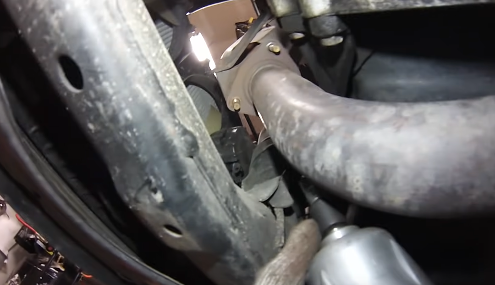
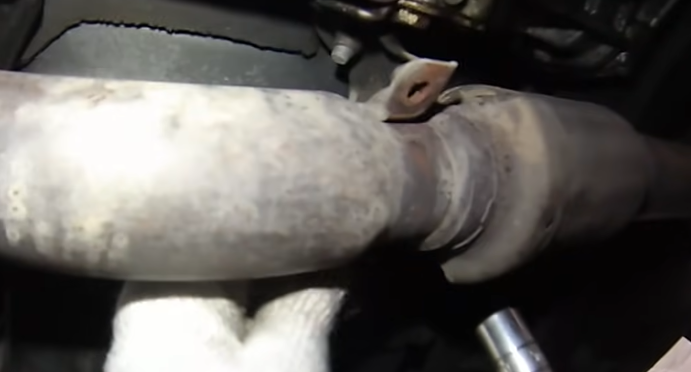
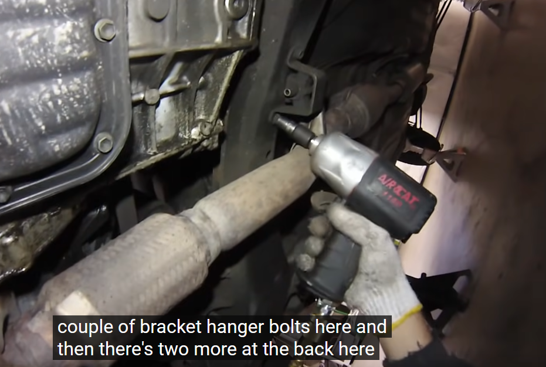
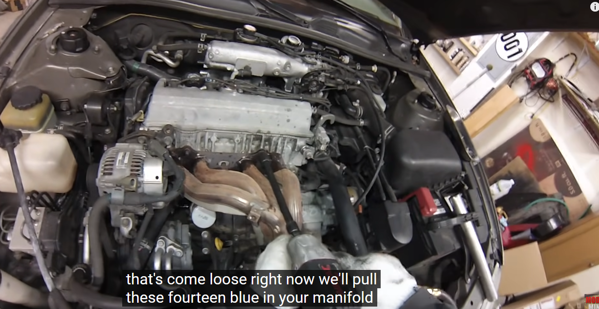
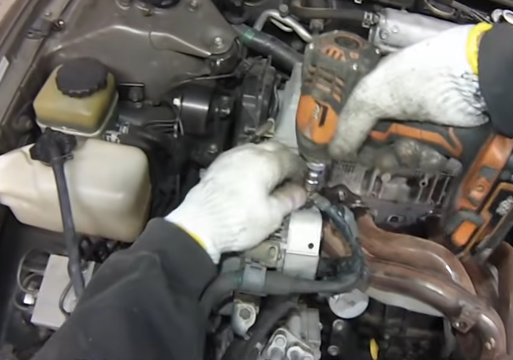
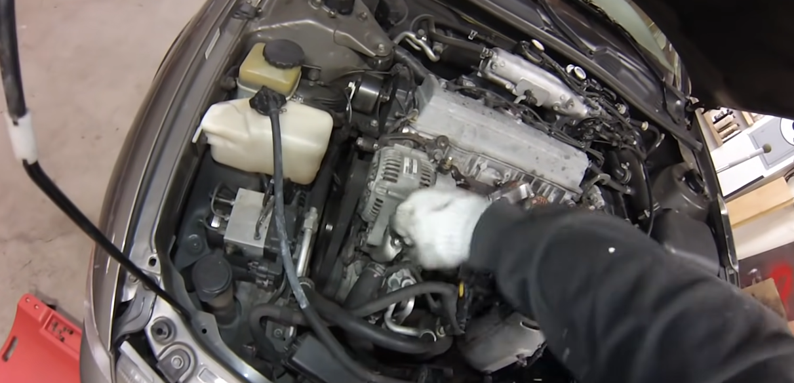
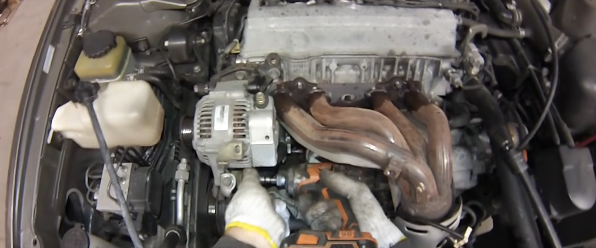
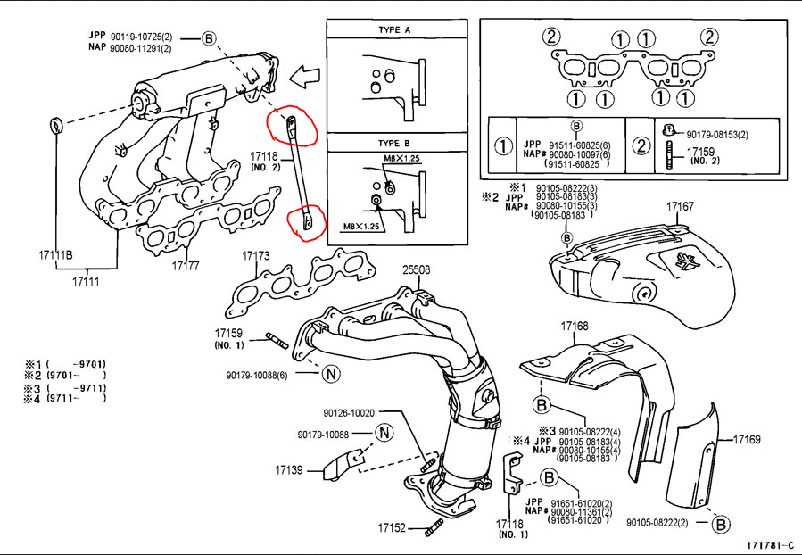

**Outline of videos by Mod MINI:**
1. https://youtu.be/dlRkcJuo6EY?si=Y4sLVkOhOkdmV6IW
2. https://youtu.be/AZDTxruWT3M?si=iaTi_0_se2RguXit
## Part 1
###### 1.1. Lower Exhaust Manifold (14mm)

###### 1.2. Lower Exhaust Manifold Bracket

###### 1.3. Upper Exhaust Manifold

###### 1.4. Alternator & Belt

Loosen Two Bracket Bolts

Loosen Belt Tightening Bolt

Remove Alternator Retaining Bolt Then Remove Alternator

###### 1.5. Loosen Last Upper Exhaust Manifold Bolt

###### 1.6. Remove Upper Exhaust Manifold Brackets

###### 1.7. Drain Coolant

###### 1.8. Disconnect All Wiring Harnesses & Engine Wiring Bracket

###### 1.9. Support The Engine

###### 1.10. Remove The Top Engine Mount

###### 1.11. Remove Bracket In Front of Timing Cover (Two Bolts, Hidden)

###### 1.12. Remove Spark Plugs

###### 1.13. Remove Radiator Hose & Manifold

###### 1.14. Remove Air Intake

###### 1.15. Remove Throttle Body (3x12mm)

###### 1.16. Remove Bracket Bolts

One Higher, One Lower, and One Under Coil Pack

One Bolt Behind Throttle Body

###### 1.17. Remove Extra Air Hoses

Use white-out or tape to mark which hoses go where.

###### 1.18. Remove 2nd Upper Engine Mount

###### 1.19. Remove EGR Valve
Two 12mm's behind the intake manifold (where hand is)

One 24mm on the bottom

Remove EGR Valve

###### 1.20. Intake Manifold Lower Bracket (12mm)

Other bolt is higher behind the sub-frame

###### 1.21. Remove Intake Manifold Bolts

Will need to mix and match going from bottom and top to get all 8 bolts.

Separate Intake Manifold

###### 1.22. Remove Fuel Rail
**Between the Fuel Rail and head there are black spaces - DO NOT LOSE!!!**

2 Bolts - one at either ends

Pull off bypass tube on backside of the head

Pull off ground bolt

###### 1.23. Remove Upper Timing Cover

4x10mm bolts on the upper timing cover

###### 1.24. Align Engine To Top Dead Center
Remove Panel Behind FR Wheel

Turn Crank Pulley With 19mm

Line-up timing mark on belt with 0 degrees before top dead-center

Line up notch with "0"

On the timing bearing cap there is a mark on the pulley that should lineup with the belt. If it doesn't, you need to rotate the engine another 360 degrees until the marks lineup

Use white-out or tape to mark the belt and ensure proper alignment. If replacing timing belt, then ignore this step.

###### 1.25. Loosen Tensioner Pulley

Need to push down on the backside of the spring housing then tighten tensioner pulley back up again

Now you can slide timing belt off from the top.

###### 1.26. Remove Valve Cover
The spark plug tubes have 30mm nuts which hold the valve cover in.

Gently pry off the seal from the edges

Remove the valve cover

###### 1.27. Inspect Camshaft Alignment

Two marks on the cam gears need to lineup on re-assembly. Use Whiteout to mark the two dots if needed

###### 1.28. Remove Exhaust Camshaft
**Remove camshaft bearings in passes to prevent a bent cam.**
Loosen each about quarter turn going outside in. Continue this gradual removal until all eight bolts are free, then remove the bearings and roll the camshaft out.

###### 1.29. Remove Intake Camshaft
Place some vice-grips on a bump on the camshaft to hold it in place.

With the grips in place, loosen the camshaft pulley and remove it.

Remove the tensioner pulley and 3x10mm to remove the camshaft plate.

Remove the bearings for the intake camshaft, then pull out the camshaft.

###### 1.30. Remove Valve Hydraulic Adjusters
Use a magnet to grab them up.

Remove cam position sensor.

###### 1.31. Loosen Head Bolts
**The 10x12mm head bolts need be removed in an outside-in manner. They also need to be installed in reverse order that they were removed.**

Start with a pass loosening a quarter turn each, then on the second pass loosen completely.

Use a magnet to pick up the bolts.

Gently pry off the head from the block.

With head lifted up, remove the EGR-VSV valve which is attached to the bottom of the head.

With this, you can remove the head completely, and pry off the head gasket.

## Part 2
###### 2.1. Inspect the head gasket for signs of failure.

Examine the rings for signs of flaking or damage. In the picture above, cylinder one has had some signs of cracking on the ring. This is where water can enter the system.

###### 2.2. Inspect cylinders and block surface.

###### 2.3. Inspect the bottom of the cylinder head.

Using a gasket scraper, clean off the remaining gasket residue.

He also uses a brass wire-wheel with minimal pressure and a solvent to clean. Brass will not scratch the aluminum. Also clean up the valve cover as best as you can.

Use a straight-edge (as straight as you can get) and check to make sure the head is not warped.

###### 2.4. Replace the Valves & Stem Seals
Using the valve stem keeper-remover tool, place it on top of the valve and hit it with a hammer. It will compress the spring, allowing the keeper to be extracted. 

**The valve will move when you do this, so make sure you have something soft underneath for the valve to hit.**

The spring top will come off, and then you can use plyers to remove the keepers.

Turn the head over, and push the valve out.

If the valve needs to be cleaned, use a wire-wheel to brush it. If doing this with a drill or wheel, always keep the valve rotating to avoid burning one side.

Use compressed air to blow out the valve holes.

Use the valve stem seal plyers to remove the old valve stem seal.

Inspect the inside of the bowl to ensure no damage is present.

The new valve stem seals come with a new plastic sleeve. Place them over the top of the valve as to not damage the stem seal.

Put the valve back in.

Put the sleeve over the top.

Put the new valve stem seal and gently squeeze in place. Push down until it bottoms out, then pull off the plastic bit.

Put the valve spring back in place.

Switch into valve assembly mode and put both keepers in to the valve spring head. Ensure that both are flush. This is easier than putting them into the tool, as it lets you see if you are lined up or not.

Lineup your assembly tool such that you are pressing directly onto the top of the valve stem.

Once you've think you have got it aligned, hit it with the hammer. May take a couple tries to get it lined up right. Shouldn't take more than three tries.

**Repeat steps for remaining valves. Note, some kits may use different seals for intake and exhaust valves.**

###### 2.5. Replace Injector Gaskets
Remove the o-ring on the end.

There is also a square, flat bushing further down.

Put on the new bushing and o-ring.

**Repeat for all injectors.**

###### 2.5. Install The Head Gasket
Dry fit the head gasket in both directions to ensure you won't install it upside down. It should only fit in one direction. Make sure the head surface is totally smooth and flat.

Lift up the head and drop it into place.

Blow out the holes where the head bolts go. This is to clear out any debris or water. Afterwards, put in new head bolts in reverse order that they were taken out.

Install in several passes, creeping up to the 36 ft-lbf torque.

###### 2.6. Reinstall Intake Manifold
Reinstall the EGRVSV

