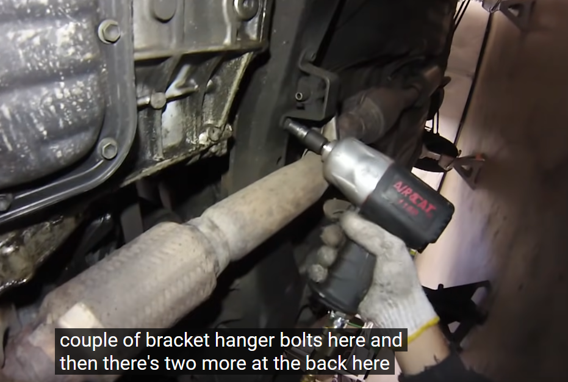

**Outline of videos by Mod MINI:**
1. https://youtu.be/dlRkcJuo6EY?si=Y4sLVkOhOkdmV6IW
2. https://youtu.be/AZDTxruWT3M?si=iaTi_0_se2RguXit
## Part 1
#### 1.1. Lower Exhaust Manifold (14mm)

#### 1.2. Lower Exhaust Manifold Bracket

#### 1.3. Upper Exhaust Manifold

#### 1.4. Alternator & Belt

Loosen Two Bracket Bolts

Loosen Belt Tightening Bolt

Remove Alternator Retaining Bolt Then Remove Alternator

#### 1.5. Loosen Last Upper Exhaust Manifold Bolt

#### 1.6. Remove Upper Exhaust Manifold Brackets

#### 1.7. Drain Coolant

#### 1.8. Disconnect All Wiring Harnesses & Engine Wiring Bracket

#### 1.9. Support The Engine

#### 1.10. Remove The Top Engine Mount

#### 1.11. Remove Bracket In Front of Timing Cover (Two Bolts, Hidden)

#### 1.12. Remove Spark Plugs

#### 1.13. Remove Radiator Hose & Manifold

#### 1.14. Remove Air Intake

#### 1.15. Remove Throttle Body (3x12mm)

#### 1.16. Remove Bracket Bolts

One Higher, One Lower, and One Under Coil Pack

One Bolt Behind Throttle Body

#### 1.17. Remove Extra Air Hoses

Use white-out or tape to mark which hoses go where.

#### 1.18. Remove 2nd Upper Engine Mount

#### 1.19. Remove EGR Valve
Two 12mm's behind the intake manifold (where hand is)

One 24mm on the bottom

Remove EGR Valve

#### 1.20. Intake Manifold Lower Bracket (12mm)

Other bolt is higher behind the sub-frame

#### 1.21. Remove Intake Manifold Bolts

Will need to mix and match going from bottom and top to get all 8 bolts.

Separate Intake Manifold

#### 1.22. Remove Fuel Rail
**Between the Fuel Rail and head there are black spaces - DO NOT LOSE!!!**

2 Bolts - one at either ends

Pull off bypass tube on backside of the head

Pull off ground bolt

#### 1.23. Remove Upper Timing Cover

4x10mm bolts on the upper timing cover

#### 1.24. Align Engine To Top Dead Center
Remove Panel Behind FR Wheel

Turn Crank Pulley With 19mm

Line-up timing mark on belt with 0 degrees before top dead-center

Line up notch with "0"

On the timing bearing cap there is a mark on the pulley that should lineup with the belt. If it doesn't, you need to rotate the engine another 360 degrees until the marks lineup

Use white-out or tape to mark the belt and ensure proper alignment. If replacing timing belt, then ignore this step.

#### 1.25. Loosen Tensioner Pulley

Need to push down on the backside of the spring housing then tighten tensioner pulley back up again

Now you can slide timing belt off from the top.

#### 1.26. Remove Valve Cover
The spark plug tubes have 30mm nuts which hold the valve cover in.

Gently pry off the seal from the edges

Remove the valve cover

#### 1.27. Inspect Camshaft Alignment

Two marks on the cam gears need to lineup on re-assembly. Use Whiteout to mark the two dots if needed

#### 1.28. Remove Exhaust Camshaft
**Remove camshaft bearings in passes to prevent a bent cam.**
Loosen each about quarter turn going outside in. Continue this gradual removal until all eight bolts are free, then remove the bearings and roll the camshaft out.

#### 1.29. Remove Intake Camshaft
Place some vice-grips on a bump on the camshaft to hold it in place.

With the grips in place, loosen the camshaft pulley and remove it.

Remove the tensioner pulley and 3x10mm to remove the camshaft plate.

Remove the bearings for the intake camshaft, then pull out the camshaft.

#### 1.30. Remove Valve Hydraulic Adjusters
Use a magnet to grab them up.

Remove cam position sensor.

#### 1.31. Loosen Head Bolts
**The 10x12mm head bolts need be removed in an outside-in manner. They also need to be installed in reverse order that they were removed.**

Start with a pass loosening a quarter turn each, then on the second pass loosen completely.

Use a magnet to pick up the bolts.

Gently pry off the head from the block.

With head lifted up, remove the EGR-VSV valve which is attached to the bottom of the head.

With this, you can remove the head completely, and pry off the head gasket.

## Part 2
#### 2.1. Inspect the head gasket for signs of failure.

Examine the rings for signs of flaking or damage. In the picture above, cylinder one has had some signs of cracking on the ring. This is where water can enter the system.

#### 2.2. Inspect cylinders and block surface.

#### 2.3. Inspect the bottom of the cylinder head.

Using a gasket scraper, clean off the remaining gasket residue.

He also uses a brass wire-wheel with minimal pressure and a solvent to clean. Brass will not scratch the aluminum. Also clean up the valve cover as best as you can.

Use a straight-edge (as straight as you can get) and check to make sure the head is not warped.

#### 2.4. Replace the Valves & Stem Seals
Using the valve stem keeper-remover tool, place it on top of the valve and hit it with a hammer. It will compress the spring, allowing the keeper to be extracted. 

**The valve will move when you do this, so make sure you have something soft underneath for the valve to hit.**

The spring top will come off, and then you can use plyers to remove the keepers.

Turn the head over, and push the valve out.

If the valve needs to be cleaned, use a wire-wheel to brush it. If doing this with a drill or wheel, always keep the valve rotating to avoid burning one side.

Use compressed air to blow out the valve holes.

Use the valve stem seal plyers to remove the old valve stem seal.

Inspect the inside of the bowl to ensure no damage is present.

The new valve stem seals come with a new plastic sleeve. Place them over the top of the valve as to not damage the stem seal.

Put the valve back in.

Put the sleeve over the top.

Put the new valve stem seal and gently squeeze in place. Push down until it bottoms out, then pull off the plastic bit.

Put the valve spring back in place.

Switch into valve assembly mode and put both keepers in to the valve spring head. Ensure that both are flush. This is easier than putting them into the tool, as it lets you see if you are lined up or not.

Lineup your assembly tool such that you are pressing directly onto the top of the valve stem.

Once you've think you have got it aligned, hit it with the hammer. May take a couple tries to get it lined up right. Shouldn't take more than three tries.

**Repeat steps for remaining valves. Note, some kits may use different seals for intake and exhaust valves.**

#### 2.5.1. Replace Injector Gaskets
Remove the o-ring on the end.

There is also a square, flat bushing further down.

Put on the new bushing and o-ring.

**Repeat for all injectors.**

#### 2.5.2. Install The Head Gasket
Dry fit the head gasket in both directions to ensure you won't install it upside down. It should only fit in one direction. Make sure the head surface is totally smooth and flat.

Lift up the head and drop it into place.

Blow out the holes where the head bolts go. This is to clear out any debris or water. Afterwards, put in new head bolts in reverse order that they were taken out.

Install in several passes, creeping up to the 36 ft-lbf torque.

#### 2.6. Reinstall Intake Manifold
Reinstall the EGRVSV

Place new intake manifold gasket. One stud on each side of the head allows for aligning the gasket.

With the intake manifold gasket in place, slide the fuel injector rail and intake manifold roughly into place.

Lift the intake manifold up onto the studs. Don't forget to use the spacers.

Tighten down the fuel rail.

Tighten all the intake manifold bolts. Do the outsides sets first, then the inner ones. Also don't forget to put the breather hose back on which connects to the port on the backside of the head.

At this point, you can also reinstall the spark plug tubes.

#### 2.7. Reinstall Intake Camshaft
Put Assembly Lube on the bearing surfaces.

Put the Intake Valve Hydraulic Adjusters back in.

Put the intake camshaft back in place.

Press in the new cam seal.

The outermost cap needs to be sealed for oil. Apply a thin coat of Hondabond to seal. The other caps do not require any sealant. 

Reinstall the intake bearings. Each bearing is marked with an "I" or an "E", number, and an arrow pointing to the front of the engine.

Tighten the cam bearings in several passes to 14 ft-lbf, also in reverse order from when they were uninstalled.

#### 2.8. Reinstall Exhaust Camshaft
Reinstall Exhaust Valve Hydraulic Adjusters.

Reinstall camshaft. You need to make the two marks line up with one another.

To do this, roll the camshaft in. It may take a couple of tries.

Once again, put assembly lube on the bearing hole.

Reinstall the bolts in a several passesas before. The exhaust side is more sensitive, and the valves require more compression than the intake side.

#### 2.9. Reinstall Timing Plate

#### 2.10. Reinstall Timing Sprocket

After installing the timing sprocket, ensure the marking still aligns.

#### 2.11. Reinstall Idler Pulley

Push down on the pulley, then tighten.

#### 2.12. Reinstall Belt

Once belt is on, back off on the tensioner and it will tighten it up.

After reinstalling belt, turn the engine one full revolution and ensure all gear and pulley positions are still lined up.

#### 2.13. Reinstall Valve Cover

Drop in the new spark plug tube seals.

Put the 30mm nuts back.

Tighten so that 1 1/2 threads are sticking out on top of the nut.

#### 2.14. Reconnect Intake Hoses
Connect the EGR valve with the new gasket. It also has an exhaust hose on the bottom.

#### 2.15. Reinstall Thermostat and Coil Pack Adapter

Connect up the hose. One bolt in front for the bypass tube.

Reinstall the coil pack.

Reconnect wiring around this area as well as the radiator hose.

#### 2.16. Reconnect Throttle Body

Thread the bolts through and install the new gasket.

Reinstall the throttle body.

Reconnect the throttle cable.

Reinstall air intake.

#### 2.17. Reinstall Spark Plugs Tubes

#### 2.18. Reinstall Exhaust Manifold
Install the new gasket for the upper exhaust manifold, then tighten.

Reinstall the lower exhaust hanging brackets.

Reinstall the lower exhaust pipe with new gasket.

Reinstall the other exhaust hanger.

#### 2.19. Reinstall Engine Mount

Hard to place back in. You have wiggle your way through and get to the hole.

#### 2.20. Install Alternator
Place Alternator mounting bracket back on.

Slide top of Alternator on first and slide in retaining bolt.

Come around on the back and put the other bolt on.

Line the bracket up.

Put the belt back on. and tighten up the tensioner.

Correct tension is you push with 15-20 lbs of force it should deflect less than an inch.

Once the belt is tight, tighten up the other bolts.

#### 2.21. Reinstall Engine Mount
Jack up the engine a little bit then put the top mount back in place.

#### 2.22. Reinstall Heat Shields & Remaining Hoses

#### 2.23. Add Coolant

Fill until the coolant is covering the top fin of the radiator. Make sure the drain plug is closed before filling. Squeeze the main radiator hose to try and burp out any bubbles.

Start the engine and continue to burp it through. When the radiator starts to overflow, put the cap back on. Be sure to put the heat on hot to allow coolant to flow through the heater core.